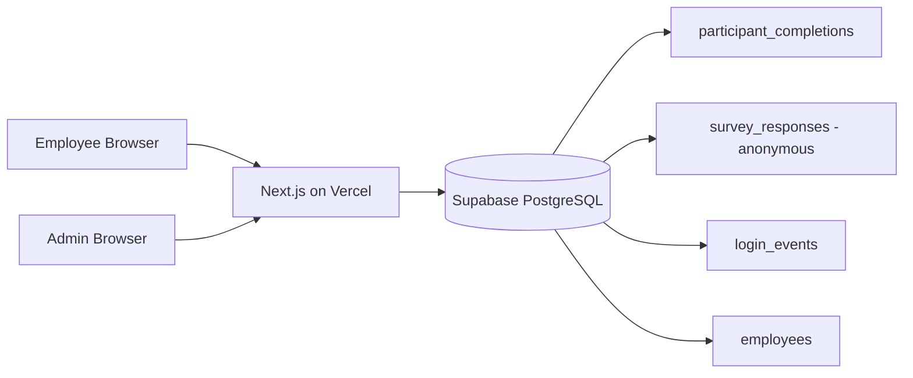
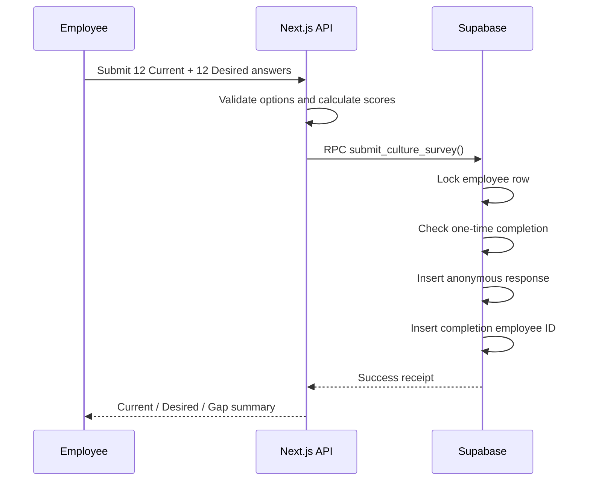

# System Design — Culture Diagnosis Platform

## Design Principles

1. **One-time submission** — บังคับทั้งระดับ Application และ Database
2. **Participation tracking without individual answer visibility** — Admin รู้ว่าใครตอบแล้ว แต่ไม่เห็นว่าคนนั้นเลือกอะไร
3. **Aggregate-first analytics** — วิเคราะห์ Current, Desired, Gap และ Rank ตาม BU / Department
4. **Privacy threshold** — ซ่อนผลกลุ่มย่อยที่มีคำตอบต่ำกว่า `MIN_GROUP_SIZE`
5. **Vercel-ready** — Frontend และ API อยู่ใน Next.js Project เดียว

## Architecture

## Authentication Flow

### Employee
1. พนักงานกรอก Employee ID
2. Password = Employee ID ซ้ำอีกครั้ง
3. Server ตรวจว่า Employee ID อยู่ใน `employees` และ status = active
4. Server สร้าง HttpOnly signed session cookie
5. ตรวจ `participant_completions` ถ้าพบแล้วจะไม่ให้ทำซ้ำ

### Admin
1. Admin Username อยู่ใน Environment Variable
2. Password เก็บเป็น bcrypt hash ใน Environment Variable
3. เมื่อ Login สำเร็จ Server สร้าง HttpOnly signed admin cookie

## Submission Flow

## Data Separation

### `participant_completions`
- employee_id
- survey_version
- submitted_at

ใช้เพื่อ:
- กันตอบซ้ำ
- คำนวณ Response Rate
- แสดงรายชื่อผู้ยังไม่ตอบ

### `survey_responses`
- ไม่มี employee_id
- BU / Department / Section / Job Level snapshot
- answers
- current_scores
- desired_scores
- gaps

ใช้เพื่อ:
- Aggregate Dashboard
- Rank Archetypes
- Culture Theme Suggestion

## One-Time Submission Enforcement

ใช้ 2 ชั้น:
1. UI / API ตรวจ completion ก่อนเปิดแบบประเมิน
2. PostgreSQL RPC ทำ transaction และมี Primary Key ที่ `participant_completions.employee_id`

แม้ผู้ใช้กดส่งพร้อมกันสอง request จะมีเพียงหนึ่ง request ที่สำเร็จ

## Scalability

สำหรับกลุ่มประมาณ 1,000 คน ระบบใช้:
- Stateless Next.js Route Handlers บน Vercel
- PostgreSQL transaction สำหรับ submission
- Dashboard fetch แบบ pagination 1,000 records ต่อรอบ
- ไม่มีการโหลด Employee Master ไปที่ Browser ฝั่งพนักงาน

## Admin Analytics Logic

1. Sum Current scores ของทุกคำตอบ
2. Sum Desired scores
3. Gap = Desired - Current
4. Rank Current, Desired และ Gap
5. Map Archetype Gap เป็น Initial Culture Themes

Theme Suggestion เป็นเพียง **Preliminary Hypothesis** ต้องตรวจสอบกับ Focus Group และ Strategic Culture Requirement ก่อนสรุป Phase 03
